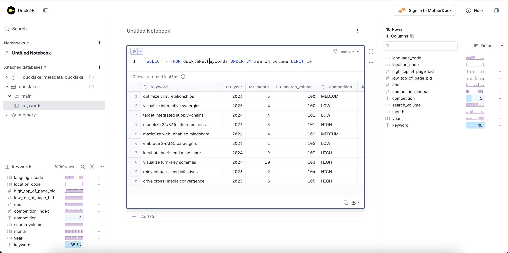

# seo-ducklake

SEO keyword analytics powered by [DuckLake](https://ducklake.select/) — an open lakehouse format that uses DuckDB as the query engine, PostgreSQL as the metadata catalog, and S3-compatible object storage.

## Architecture

- **DuckDB** — in-process analytical query engine
- **PostgreSQL** — DuckLake metadata catalog
- **Object storage** — AWS S3 or MinIO (local S3-compatible) for Parquet data files
- **pgAdmin** — optional Postgres web UI (running on port 5050)

### Project structure

| File | Description |
|---|---|
| `storage.py` | Storage abstraction — `MinioStorage` and `S3Storage` backends behind a `DuckLakeStorage` protocol |
| `client.py` | `DuckLakeClient` — wraps DuckDB connection, catalog attachment, and query execution |
| `setup_ducklake.py` | Creates the storage bucket, attaches the DuckLake catalog, and creates the keywords table |
| `seed_ducklake.py` | Generates and inserts 100k fake keyword rows |
| `queries.py` | Runs demo analytical queries with timing |
| `ui.py` | Launches the DuckDB web UI with the DuckLake catalog attached |
| `cleanup.py` | Deletes all keyword data, drops the table, and cleans up DuckLake snapshots/files |

## Schema

`ducklake.main.keywords`

| Column | Type |
|---|---|
| keyword | VARCHAR |
| year | BIGINT |
| month | BIGINT |
| search_volume | BIGINT |
| competition | VARCHAR (LOW/MEDIUM/HIGH) |
| competition_index | DOUBLE |
| cpc | DOUBLE |
| low_top_of_page_bid | DOUBLE |
| high_top_of_page_bid | DOUBLE |
| location_code | INTEGER |
| language_code | INTEGER |

## Setup

### Prerequisites

- Python 3.11+
- Docker & Docker Compose
- [uv](https://github.com/astral-sh/uv) (recommended)

### 1. Configure environment

```bash
cp .env.example .env
# fill in credentials in .env
```

Required variables for Postgres + pgAdmin are always needed. For object storage, configure either the MinIO or AWS S3 variables depending on your backend:

| Variable | Backend |
|---|---|
| `MINIO_ROOT_USER`, `MINIO_ROOT_PASSWORD`, `MINIO_BUCKET` | MinIO |
| `AWS_ACCESS_KEY_ID`, `AWS_SECRET_ACCESS_KEY`, `S3_BUCKET`, `AWS_REGION` | AWS S3 |

### 2. Start infrastructure

```bash
docker compose up -d
```

This starts PostgreSQL (5432), pgAdmin (5050), and MinIO (9000/9001).

> If using AWS S3 instead of MinIO, you can skip the MinIO service or remove it from `docker-compose.yml`.

### 3. Install dependencies

```bash
uv sync
```

### 4. Initialize DuckLake

Creates the storage bucket, attaches the DuckLake catalog, and creates the keywords table:

```bash
uv run python setup_ducklake.py
```

### 5. Seed data

Generates and inserts 100k fake keyword rows:

```bash
uv run python seed_ducklake.py
```

### 6. Run demo queries

```bash
uv run python queries.py
```

### 7. Launch DuckDB UI (optional)

Opens the built-in DuckDB web UI with the DuckLake catalog attached:

```bash
uv run python ui.py
```

The UI is available at `http://localhost:4213`. Press Enter in the terminal to stop.



### 8. Cleanup (optional)

Deletes all keyword data, drops the table, and expires DuckLake snapshots:

```bash
uv run python cleanup.py
```
